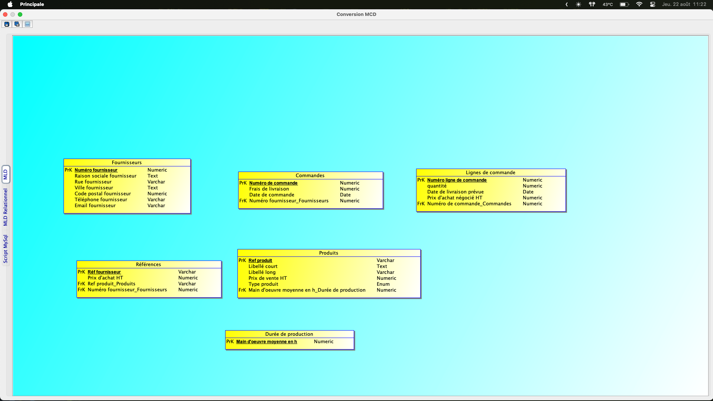

# Règles de nomenclature utilisées
- noms en minuscules avec des underscores pour les espaces
- pas de caractère spéciaux
- pas d'accents
- les clés primaires comportent _id à la fin lorsqu'elles correspondent à un auto increment
- les clés étrangères ont le même nom que la clé primaire de la table référencée

# Exo 1

## Dictionnaire de données


## MCD


## MLD


## MLDR
- produits(<u>ref_produit</u>, libelle_court, libelle_long, prix_vente_ht, type_produit, #main_oeuvre_moyenne_h)

- fournisseurs(<u>fournisseur_id</u>, raison_sociale_fournisseur, rue_fournisseur, ville_fournisseur, code_postal_fournisseur, telephone_fournisseur, email_fournisseur)

- duree_production(<u>main_oeuvre_moyenne_h</u>)

- references(<u>ref_fournisseur</u>, prix_achat_ht, #ref_produit, #fournisseur_id)

- commandes(<u>commande_id</u>, frais_livraison, date_commande, #fournisseur_id)

- lignes_commande(<u>ligne_commande_id</u>, quantite, date_livraison_prevue, prix_achat_negocie_ht, #commande_id)

## Script SQL
CREATE TABLE produits (
    ref_produit VARCHAR(30) PRIMARY KEY,
    libelle_court VARCHAR(30) NOT NULL,
    libelle_long VARCHAR(255),
    prix_vente_ht DECIMAL(10, 2) NOT NULL,
    type_produit ENUM('fabrique', 'approvisionne') NOT NULL,
    main_oeuvre_moyenne_h DECIMAL(5, 2),
    FOREIGN KEY (main_oeuvre_moyenne_h) REFERENCES duree_production(main_oeuvre_moyenne_h)
);

CREATE TABLE fournisseurs (
    fournisseur_id INT AUTO_INCREMENT PRIMARY KEY,
    raison_sociale_fournisseur VARCHAR(50) NOT NULL,
    rue_fournisseur VARCHAR(50),
    ville_fournisseur VARCHAR(30),
    code_postal_fournisseur DECIMAL(5, 0),
    telephone_fournisseur VARCHAR(20),
    email_fournisseur VARCHAR(30)
);

CREATE TABLE duree_production (
    main_oeuvre_moyenne_h DECIMAL(5, 2) PRIMARY KEY
);

CREATE TABLE references (
    ref_fournisseur VARCHAR(30) PRIMARY KEY,
    prix_achat_ht DECIMAL(10, 2) NOT NULL,
    ref_produit VARCHAR(30) NOT NULL,
    fournisseur_id INT NOT NULL,
    FOREIGN KEY (ref_produit) REFERENCES produits(ref_produit),
    FOREIGN KEY (fournisseur_id) REFERENCES fournisseurs(fournisseur_id)
);

CREATE TABLE commandes (
    commande_id INT AUTO_INCREMENT PRIMARY KEY,
    frais_livraison DECIMAL(5, 2) NOT NULL,
    date_commande DATE NOT NULL,
    fournisseur_id INT NOT NULL,
    FOREIGN KEY (fournisseur_id) REFERENCES fournisseurs(fournisseur_id)
);

CREATE TABLE lignes_commande (
    ligne_commande_id INT AUTO_INCREMENT PRIMARY KEY,
    quantite DECIMAL(6, 0) NOT NULL,
    date_livraison_prevue DATE NOT NULL,
    prix_achat_negocie_ht DECIMAL(10, 2) NOT NULL,
    commande_id INT NOT NULL,
    FOREIGN KEY (commande_id) REFERENCES commandes(commande_id)
);

## Exemple de requête
Cette requête SQL permet d'obtenir la somme des frais de livraison du 22/07/24 au 22/08/24

``` sql
SELECT SUM(frais_livraison) AS total_frais_livraison FROM commandes WHERE date_commande BETWEEN '2024-08-22' AND '2024-07-22'; 
```

# Exo 2

## Dictionnaire de données
