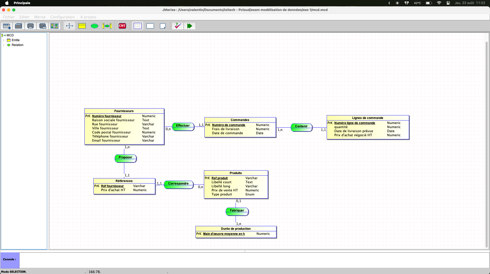
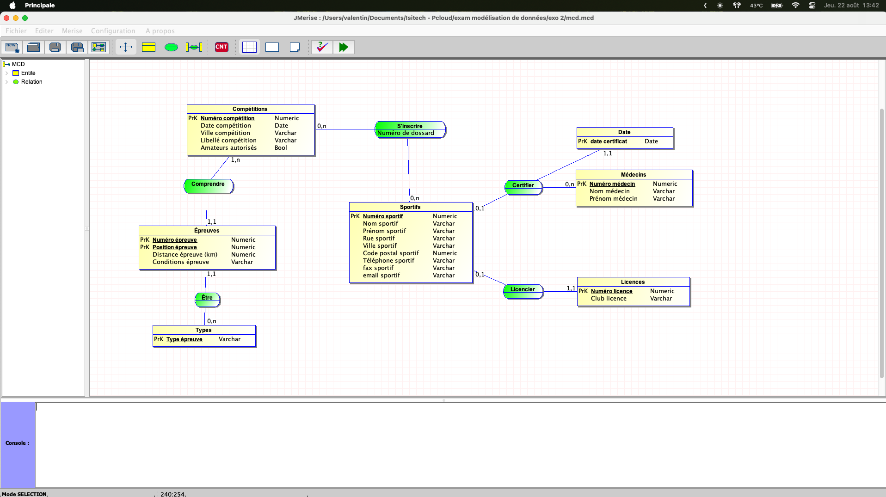
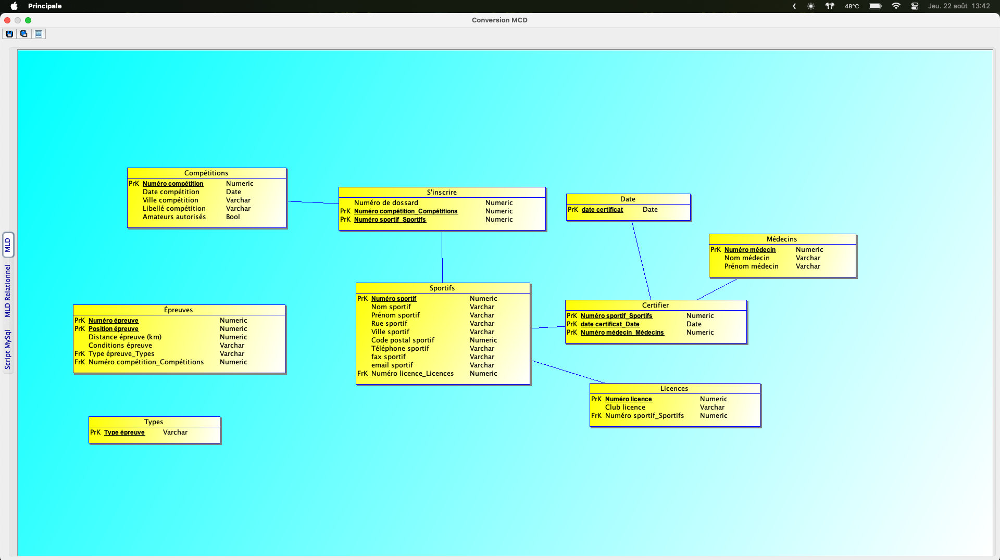

# Règles de nomenclature utilisées
- noms en minuscules avec des underscores pour les espaces
- pas de caractère spéciaux
- pas d'accents
- les clés primaires comportent _id à la fin lorsqu'elles correspondent à un auto increment
- les clés étrangères ont le même nom que la clé primaire de la table référencée

# Exo 1

## Dictionnaire de données


## MCD


## MLD


## MLDR
- produits(<u>ref_produit</u>, libelle_court, libelle_long, prix_vente_ht, type_produit, #main_oeuvre_moyenne_h)

- fournisseurs(<u>fournisseur_id</u>, raison_sociale_fournisseur, rue_fournisseur, ville_fournisseur, code_postal_fournisseur, telephone_fournisseur, email_fournisseur)

- duree_production(<u>main_oeuvre_moyenne_h</u>)

- references_produits(<u>ref_fournisseur</u>, prix_achat_ht, #ref_produit, <u>#fournisseur_id</u>)

- commandes(<u>commande_id</u>, frais_livraison, date_commande, #fournisseur_id)

- lignes_commande(<u>ligne_commande_id</u>, quantite, date_livraison_prevue, prix_achat_negocie_ht, #commande_id)

## Script SQL
``` sql
CREATE DATABASE xprod;

use xprod;

CREATE TABLE duree_production (
    main_oeuvre_moyenne_h DECIMAL(5, 2) PRIMARY KEY
);

CREATE TABLE produits (
    ref_produit VARCHAR(30) PRIMARY KEY,
    libelle_court VARCHAR(30) NOT NULL,
    libelle_long VARCHAR(255),
    prix_vente_ht DECIMAL(10, 2) NOT NULL,
    type_produit ENUM('fabrique', 'approvisionne') NOT NULL,
    main_oeuvre_moyenne_h DECIMAL(5, 2),
    FOREIGN KEY (main_oeuvre_moyenne_h) REFERENCES duree_production(main_oeuvre_moyenne_h)
);

CREATE TABLE fournisseurs (
    fournisseur_id INT AUTO_INCREMENT PRIMARY KEY,
    raison_sociale_fournisseur VARCHAR(50) NOT NULL,
    rue_fournisseur VARCHAR(50),
    ville_fournisseur VARCHAR(30),
    code_postal_fournisseur DECIMAL(5, 0),
    telephone_fournisseur VARCHAR(20),
    email_fournisseur VARCHAR(30)
);

CREATE TABLE references_produits (
    ref_fournisseur VARCHAR(30),
    prix_achat_ht DECIMAL(10, 2) NOT NULL,
    ref_produit VARCHAR(30) NOT NULL,
    fournisseur_id INT NOT NULL,
    PRIMARY KEY (ref_fournisseur, fournisseur_id),
    FOREIGN KEY (ref_produit) REFERENCES produits(ref_produit),
    FOREIGN KEY (fournisseur_id) REFERENCES fournisseurs(fournisseur_id)
);

CREATE TABLE commandes (
    commande_id INT AUTO_INCREMENT PRIMARY KEY,
    frais_livraison DECIMAL(5, 2) NOT NULL,
    date_commande DATE NOT NULL,
    fournisseur_id INT NOT NULL,
    FOREIGN KEY (fournisseur_id) REFERENCES fournisseurs(fournisseur_id)
);

CREATE TABLE lignes_commande (
    ligne_commande_id INT AUTO_INCREMENT PRIMARY KEY,
    quantite DECIMAL(6, 0) NOT NULL,
    date_livraison_prevue DATE NOT NULL,
    prix_achat_negocie_ht DECIMAL(10, 2) NOT NULL,
    commande_id INT NOT NULL,
    FOREIGN KEY (commande_id) REFERENCES commandes(commande_id)
);
```

## Exemple de requête
Cette requête SQL permet d'obtenir la somme des frais de livraison du 22/07/24 au 22/08/24

``` sql
SELECT SUM(frais_livraison) AS total_frais_livraison FROM commandes WHERE date_commande BETWEEN '2024-08-22' AND '2024-07-22'; 
```

# Exo 2

## Dictionnaire de données


## MCD


## MLD


## MDLR
- sportifs(<u>numero_sportif</u>, nom_sportif, prenom_sportif, rue_sportif, ville_sportif, code_postal_sportif, telephone_sportif, fax_sportif, email_sportif, #numero_licence)

- licences(<u>numero_licence</u>, club_licence, #numero_sportif)

- date(<u>date_certificat</u>)

- medecins(<u>numero_medecin</u>, nom_medecin, prenom_medecin)

- competitions(<u>numero_competition</u>, date_competition, ville_competition, libelle_competition, amateurs_autorises)

- epreuves(<u>numero_epreuve</u>, #position_epreuve, distance_epreuve_km, conditions_epreuve, #type_epreuve, #numero_competition)

- types(<u>type_epreuve</u>)

- certifications(<u>numero_sportif</u>, <u>#date_certificat</u>, <u>#numero_medecin</u>)

- inscriptions(<u>numero_dossard</u>, <u>#numero_competition</u>, <u>#numero_sportif</u>)

## Script SQL
```sql 
CREATE DATABASE competitions;

use competitions;

CREATE TABLE sportifs (
    numero_sportif_id INT AUTO_INCREMENT PRIMARY KEY,
    nom_sportif VARCHAR(30) NOT NULL,
    prenom_sportif VARCHAR(30) NOT NULL,
    rue_sportif VARCHAR(50) NOT NULL,
    ville_sportif VARCHAR(30) NOT NULL,
    code_postal_sportif INT NOT NULL,
    telephone_sportif VARCHAR(15) NOT NULL,
    fax_sportif VARCHAR(15) NOT NULL,
    email_sportif VARCHAR(30) NOT NULL
);

CREATE TABLE licences (
    numero_licence INT PRIMARY KEY,
    club_licence VARCHAR(30) NOT NULL,
    numero_sportif_id INT NOT NULL,
    FOREIGN KEY (numero_sportif_id) REFERENCES sportifs(numero_sportif_id)
);

CREATE TABLE date (
    date_certificat DATE PRIMARY KEY
);

CREATE TABLE medecins (
    numero_medecin_id INT AUTO_INCREMENT PRIMARY KEY,
    nom_medecin VARCHAR(30) NOT NULL,
    prenom_medecin VARCHAR(30)
);

CREATE TABLE competitions (
    numero_competition_id INT AUTO_INCREMENT PRIMARY KEY,
    date_competition DATE NOT NULL,
    ville_competition VARCHAR(30) NOT NULL,
    libelle_competition VARCHAR(50) NOT NULL,
    amateurs_autorises BOOLEAN NOT NULL
);

CREATE TABLE types (
    type_epreuve VARCHAR(50) PRIMARY KEY
);

CREATE TABLE epreuves (
    numero_epreuve_id INT AUTO_INCREMENT PRIMARY KEY,
    position_epreuve INT NOT NULL,
    distance_epreuve_km DECIMAL(5,2) NOT NULL,
    conditions_epreuve VARCHAR(1024) NOT NULL,
    type_epreuve VARCHAR(50) NOT NULL,
    numero_competition_id INT NOT NULL,
    FOREIGN KEY (type_epreuve) REFERENCES types(type_epreuve),
    FOREIGN KEY (numero_competition_id) REFERENCES competitions(numero_competition_id)
);

CREATE TABLE certifications (
    numero_sportif_id INT NOT NULL,
    date_certificat DATE NOT NULL,
    numero_medecin_id INT NOT NULL,
    PRIMARY KEY (numero_sportif_id, date_certificat, numero_medecin_id),
    FOREIGN KEY (numero_sportif_id) REFERENCES sportifs(numero_sportif_id),
    FOREIGN KEY (date_certificat) REFERENCES date(date_certificat),
    FOREIGN KEY (numero_medecin_id) REFERENCES medecins(numero_medecin_id)
);

CREATE TABLE inscriptions (
    numero_dossard_id INT NOT NULL,
    numero_competition_id INT NOT NULL,
    numero_sportif_id INT NOT NULL,
    PRIMARY KEY (numero_competition_id, numero_sportif_id),
    FOREIGN KEY (numero_competition_id) REFERENCES competitions(numero_competition_id),
    FOREIGN KEY (numero_sportif_id) REFERENCES sportifs(numero_sportif_id)
);
```

## Exemple requête SQL
Cette requête permet d'obtenir l'identifiant des sportifs ainsi que leurs numéros de dossard pour la competition numéro 1.
``` sql 
SELECT numero_sportif_id, numero_dossard_id FROM inscriptions WHERE numero_competition_id = 1;
```
